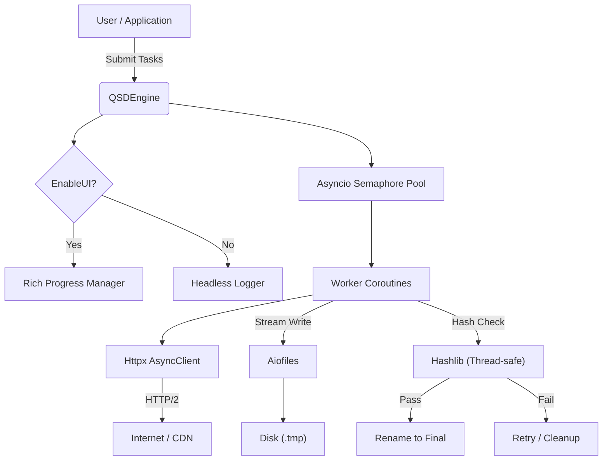

# QSDE (Qustellar Smart Download Engine)

<div align="center">


[](https://www.python.org/)
[](LICENSE)
[]()
<br/>
[](https://docs.python.org/3/library/asyncio.html)
[](https://www.python-httpx.org/)
[](https://github.com/Textualize/rich)
[]()

<p align="center">
  <b>High-Performance</b> • <b>Fault-Tolerant</b> • <b>Dual-Mode (GUI/API)</b> • <b>Production Ready</b>
</p>

</div>

---

## 📖 Introduction

**QSDE (Qustellar Smart Download Engine)** is a state-of-the-art asynchronous file download library designed for high-concurrency scenarios. Built on top of [**`asyncio`**](https://docs.python.org/3/library/asyncio.html) and [**`httpx`**](https://www.python-httpx.org/), it abandons traditional multi-threading for a pure non-blocking I/O architecture, capable of handling thousands of concurrent tasks with minimal resource overhead.

Whether you are building a modern game launcher (like OLAN), a large-scale crawler, or a system updater, QSDE provides the robustness and **"Zero-Jitter"** UI experience you demand.

---

## ✨ Key Features

* **🚀 Pure Async Architecture**
    Powered by Python's native `asyncio` event loop, maximizing throughput on high-bandwidth networks without the overhead of thread context switching.

* **🖥️ Dual Operation Modes**
    * **GUI Mode**: Features a beautiful, "Zero-Jitter" TUI powered by [**Rich**](https://github.com/Textualize/rich) (60fps smooth rendering).
    * **API Mode**: Silent, headless operation with callbacks, perfect for background integration in PyQt/PySide apps.

* **🛡️ Industrial Robustness**
    * **Atomic Cleanup**: Guarantees no corrupt `.tmp` files remain on disk upon failure or cancellation.
    * **Smart Resilience**: Auto-retries with exponential backoff; persistent error logging ensures failures are never missed.
    * **Full-Chain Cancellation**: Instantly halts all network I/O, disk writes, and hash verification tasks safely.

* **🔒 Integrity & Security**
    Built-in support for **MD5, SHA1, SHA256, SHA512** verification and smart proxy configuration.

* **🔧 PascalCase API**
    Fully standardized `PascalCase` naming convention for intuitive, high-level usage, tailored for enterprise-grade development standards.

---

## 📦 Installation

QSDE relies on modern Python libraries. Install dependencies via pip:

```bash
pip install httpx aiofiles rich

```

> **Note**: Python 3.8 or higher is required.

---

## ⚡ Quick Start

### 1. The Visual Experience (GUI Mode)

Ideal for CLI tools or scripts where user feedback is essential.

```python
import asyncio
from QSDE import QSDEngine, DownloadTask, HashAlgorithm

async def Main():
    # Initialize Engine with UI enabled
    Engine = QSDEngine(
        MaxConcurrency=8, 
        EnableUI=True
    )

    # Define Tasks
    Tasks = [
        DownloadTask(
            Url="https://proof.ovh.net/files/10Mb.dat",
            SavePath="downloads/file_1.dat",
            ExpectedHash="...", # Optional: Add hash for verification
            HashAlgo=HashAlgorithm.SHA256
        ),
        DownloadTask(
            Url="https://proof.ovh.net/files/1Mb.dat",
            SavePath="downloads/file_2.dat"
        )
    ]

    # Start Batch Download
    await Engine.StartBatchDownload(Tasks)

if __name__ == "__main__":
    asyncio.run(Main())

```

### 2. Silent Integration (API Mode)

Ideal for embedding into **PyQt/PySide** applications or background services.

```python
async def RunSilent():
    # Initialize in Headless mode
    Engine = QSDEngine(EnableUI=False)
    
    # Optional: Hook into progress callbacks
    def OnProgress(Finished, Total):
        print(f"Progress: {Finished}/{Total}")

    Engine.SetCallbacks(OnTotalProgress=OnProgress)

    Tasks = [...] # Your tasks list
    Results = await Engine.StartBatchDownload(Tasks)
    
    print(f"Success: {Results['success']}, Failed: {Results['failed']}")

```

---

## ⚙️ Advanced Configuration

QSDE offers a **PascalCase** API for dynamic configuration, giving you full control at runtime.

### Network Configuration

Change proxies, user-agents, or timeouts on the fly without restarting the engine.

```python
Engine.SetNetworkConfig(
    Proxy="http://127.0.0.1:7890",
    UserAgent="MyCustomApp/2.0 (Compatible; MSIE 9.0)",
    TimeOut=60
)

```

### Runtime Performance Tuning

Adjust concurrency limits based on system load or user preference.

```python
Engine.SetRuntimeConfig(
    MaxConcurrency=32,  # Turbo mode
    ChunkSize=131072    # 128KB buffer for faster disk I/O
)

```

### Global Cancellation

Stop everything instantly. Safe to call from any thread or signal handler.

```python
Engine.CancelAll()

```

---

## 🧩 Architecture



---

## 📝 License

Copyright © 2026 **Qustellar**. All rights reserved.

Licensed under the **Apache License, Version 2.0**. You may obtain a copy of the License at:

http://www.apache.org/licenses/LICENSE-2.0

Unless required by applicable law or agreed to in writing, software distributed under the License is distributed on an "AS IS" BASIS, WITHOUT WARRANTIES OR CONDITIONS OF ANY KIND, either express or implied.

---

<div align="center">
<sub>Designed with ❤️ by Qustellar for the Future of Downloading.</sub>


<a href="mailto:ecospace@qq.com">Contact Support</a>
</div>